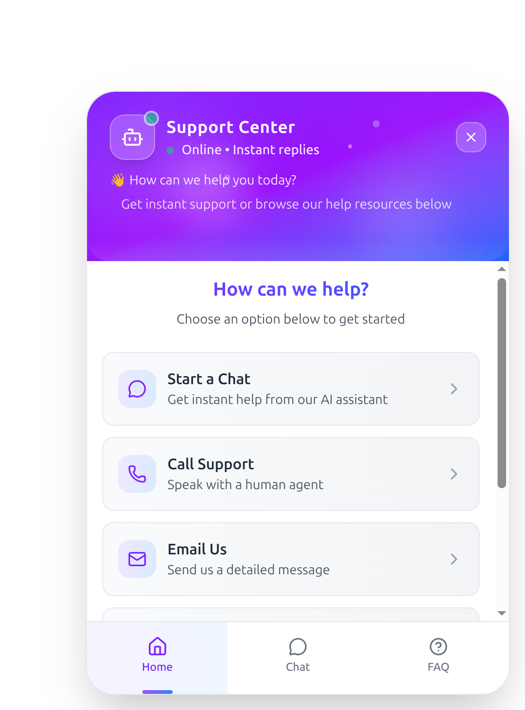

# Ampere Electric Chatbot 🚗⚡

A modern, responsive customer support chatbot built with React and TypeScript, featuring real-time webhook integration and animated UI components. Perfect for electric vehicle companies, customer service, and support automation.



## ✨ Features

- **🎨 Modern UI Design**: Beautiful gradient animations and smooth transitions
- **💬 Real-time Chat**: Instant messaging with typing indicators
- **🔗 Webhook Integration**: Seamless backend API integration
- **📱 Responsive Design**: Works perfectly on desktop and mobile devices
- **🏠 Multi-Screen Navigation**: Home, Chat, and FAQ sections
- **💾 Message Persistence**: Chat history saved across sessions
- **⚡ Quick Actions**: Pre-defined support options and FAQ
- **🔄 Message Queuing**: Handles multiple messages efficiently
- **📞 Contact Integration**: Direct phone and email support options
- **🎯 User Session Management**: Unique user identification and tracking

## 🚀 Demo

[Live Demo](https://your-demo-link.com) | [Screenshots](#screenshots)

## 🛠️ Installation

### Prerequisites

- Node.js (v16 or higher)
- npm or yarn package manager

### Setup

1. **Clone the repository**
   ```bash
   git clone https://github.com/alihassanml/Ampere-Electric-Chatbot.git
   cd Ampere-Electric-Chatbot
   ```

2. **Install dependencies**
   ```bash
   npm install
   # or
   yarn install
   ```

3. **Configure webhook endpoint**
   
   Update the webhook URL in the chatbot component:
   ```typescript
   const WEBHOOK_URL = "https://your-webhook-endpoint.com/webhook/chatbot";
   ```

4. **Start the development server**
   ```bash
   npm start
   # or
   yarn start
   ```

5. **Build for production**
   ```bash
   npm run build
   # or
   yarn build
   ```

## 📋 Usage

### Basic Implementation

```jsx
import CustomerSupportChatbot from './components/CustomerSupportChatbot';

function App() {
  return (
    <div className="App">
      {/* Your app content */}
      <CustomerSupportChatbot />
    </div>
  );
}
```

### Webhook Configuration

The chatbot sends messages to your webhook endpoint in this format:

```json
{
  "user_id": "user_abc123",
  "message": "Hello, I need help with my order"
}
```

Expected webhook response format:

```json
{
  "reply": "Hello! I'd be happy to help you with your order.\\kIs there anything specific you'd like to know?"
}
```

**Note**: Use `\\k` to separate multiple messages in a single response.

## ⚙️ Configuration

### Customization Options

1. **Webhook URL**: Update the `WEBHOOK_URL` constant
2. **Company Information**: Modify contact details (phone, email)
3. **FAQ Content**: Update the `faqData` array
4. **Quick Actions**: Customize the `quickActions` array
5. **Styling**: Modify Tailwind CSS classes for custom branding

### Environment Variables

Create a `.env` file in the root directory:

```env
REACT_APP_WEBHOOK_URL=https://your-webhook-endpoint.com
REACT_APP_COMPANY_PHONE=1-800-123-4567
REACT_APP_COMPANY_EMAIL=support@company.com
```

## 🎨 Customization

### Brand Colors

Update the gradient colors in the component:

```css
/* Change from violet/blue to your brand colors */
from-violet-600 via-purple-600 to-blue-600
from-violet-500 to-blue-500
```

### Company Information

Update these sections in the code:
- Phone number: `tel:1-800-123-4567`
- Email: `mailto:support@company.com`
- Business hours in the FAQ section

## 🔧 API Integration

### Webhook Requirements

Your webhook should:

1. **Accept POST requests** with JSON body
2. **Return JSON response** with a `reply` field
3. **Handle user sessions** using the provided `user_id`
4. **Support multiple messages** using `\\k` delimiter

### Example Webhook Response

```javascript
// Single message
{
  "reply": "Thank you for contacting us!"
}

// Multiple messages
{
  "reply": "Thank you for contacting us!\\kHow can I help you today?\\kI'm here to assist with any questions."
}
```

## 📱 Screenshots

<!-- Add your screenshots here -->
[Add screenshots of your chatbot interface]

## 🧪 Testing

```bash
# Run tests
npm test

# Run tests with coverage
npm run test:coverage
```

## 🔨 Built With

- **[React](https://reactjs.org/)** - Frontend framework
- **[TypeScript](https://www.typescriptlang.org/)** - Type safety
- **[Tailwind CSS](https://tailwindcss.com/)** - Styling framework
- **[Lucide React](https://lucide.dev/)** - Icon library
- **[React Hooks](https://reactjs.org/docs/hooks-intro.html)** - State management

## 📂 Project Structure

```
src/
├── components/
│   └── CustomerSupportChatbot.tsx    # Main chatbot component
├── types/
│   └── index.ts                      # TypeScript type definitions
├── styles/
│   └── globals.css                   # Global styles
└── utils/
    └── sessionStorage.ts             # Session management utilities
```

## 🤝 Contributing

1. Fork the repository
2. Create a feature branch (`git checkout -b feature/amazing-feature`)
3. Commit your changes (`git commit -m 'Add amazing feature'`)
4. Push to the branch (`git push origin feature/amazing-feature`)
5. Open a Pull Request

### Development Guidelines

- Follow TypeScript best practices
- Use ESLint and Prettier for code formatting
- Write meaningful commit messages
- Add tests for new features
- Update documentation as needed

## 📝 License

This project is licensed under the MIT License - see the [LICENSE](LICENSE) file for details.

## 🙋‍♂️ Support

- **GitHub Issues**: [Report bugs or request features](https://github.com/alihassanml/Ampere-Electric-Chatbot/issues)
- **Email**: [alihassanml@email.com](mailto:alihassanml@email.com)
- **Documentation**: Check the [Wiki](https://github.com/alihassanml/Ampere-Electric-Chatbot/wiki)

## 🔄 Changelog

### v1.0.0
- Initial release with webhook integration
- Multi-screen navigation (Home, Chat, FAQ)
- Message persistence and user session management
- Responsive design with animated UI

## 🔮 Roadmap

- [ ] Voice message support
- [ ] File upload functionality
- [ ] Multi-language support
- [ ] Chat export feature
- [ ] Admin dashboard integration
- [ ] Analytics and reporting
- [ ] Dark mode theme

## ⭐ Show Your Support

If this project helped you, please give it a ⭐ on GitHub!

---

**Made with ❤️ by [Ali Hassan](https://github.com/alihassanml)**